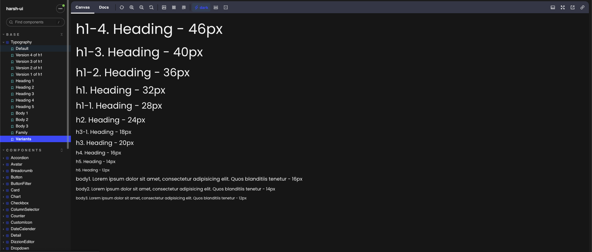

**harsh-ui** is the library that drives internal project built by me.

## Preview



## Installation

---

Install all the dependencies by executing following command

```
npm i
```

**harsh-ui** has few direct dependcies which are required to run this library smoothly for specific component

```
npm i ckeditor4-react@4.0.2 react-datepicker@4.11.0 react-dropzone@14.2.3 react-file-viewer@1.2.1
```

**harsh-ui** has few peer dependencies which are required to run this library smoothly. Install following dependencies by running following command

```
npm i react@17.0.1 react-dom@17.0.1 react-router-dom@5.0.1 react-toastify@9.1.1 dompurify@3.0.2

```

harsh-ui depends on react-toastify for Toasters, so the styles for toaster must be imported to your main scss entry point.

```
@import "react-toastify/dist/ReactToastify.min.css";
```

Also make sure to include <ToastContainer /> in your application.

```
import React from "react";

import { ToastContainer } from "react-toastify";

const App = () => {
return (
<>
<ToastContainer />
// Your Root Component will render here
</>
);
};

```

For more information check the Toasters stories.

## Development

---

You can create new components in the `src/lib/components` and export them from `src/lib/index.js`.

You can also create a new story under `src/stories/Components`.

Running the `npm run storybook` command starts a storybook app. Use this application to test out changes. Note that nothing in the `stories` folder will be bundled with harsh-ui.

### How to use Icons

---

```
import React from "react";

import { Visiblity } from "harsh-ui/icons";

const MyComponent = () => {
return (
<>
// Your other component/native elements will render here
<Visiblity/>
// Your other component/native elements will render here
</>
);
};

```

## Building

---

Will publish it on npm soon
